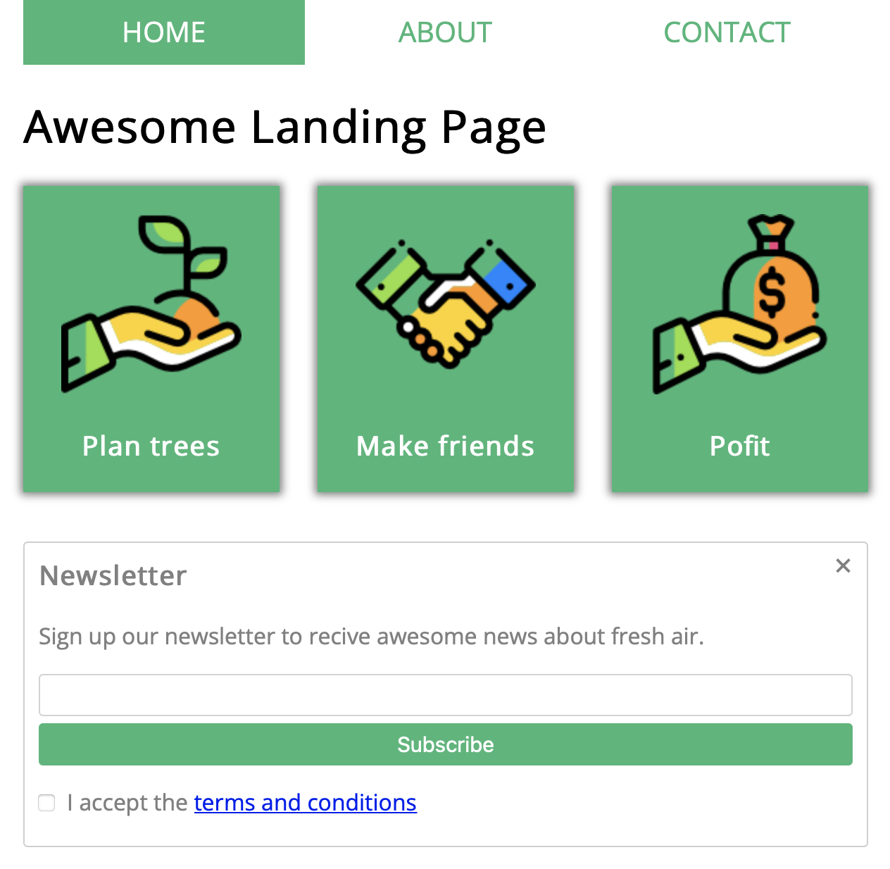

# Example Site

This is a sample readme file for my GitHub repo. I'm learning markdown.

* Green Fox Academy
* MyFirstApp Coding Camp
* VS Code and GitHub

## Basic lesson
[example link](https://szelpe.github.io)

1. flexbox positioning
2. images
3. newsletter form
4. absolute positioning

## Screenshot

:grinning: What do you think about of these updates?